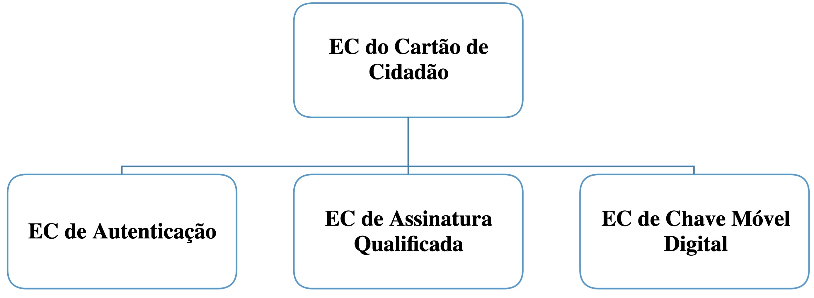
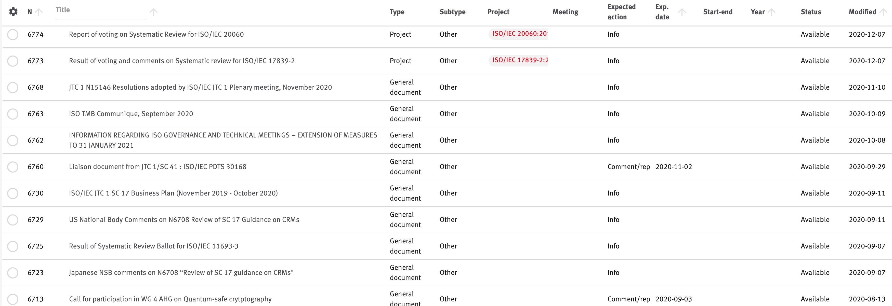

# Avaliação prática 2 - Projeto de desenvolvimento (PD)

De seguida são apresentados os vários projetos de desenvolvimento. O relatório final e o código fonte deverá ser colocado na área do Grupo no github até ao dia 15/06/2021, na subdiretoria "AP2-PD". Note que no relatório tem de indicar os passos necessários para se poder testar o código fonte, incluindo o ambiente (que se espera que seja preferencialmente Linux).

A apresentação e discussão do trabalho será posteriormente marcada em data/hora a indicar.

Note que o projeto de desenvolvimento, para além do desenvolvimento em si, inclui componentes de:

+ Identificação do “_Software Assurance Maturity Model_ (SAMM)” da equipa, 
+ RGPD PIA, e
+ _Compliance_ com boas práticas de desenvolvimento.

Para algumas destas componentes terão que entregar um relatório no âmbito das fichas de trabalho (avaliação prática 1), na sequência de aulas teóricas sobre o tema. Esses relatórios farão parte do relatório final do projeto de desenvolvimento.

## Objectivos

O objetivo destes projetos de desenvolvimento não é aprender a programar (esse poderia ser o objetivo se fosse um projeto no âmbito da licenciatura), mas

+ Integrar/utilizar/alterar frameworks, APIs, código de terceiros, ..., que sejam relevantes para o seu projeto, de modo a simplificarem o desenvolvimento e/ou aumentarem a segurança;
+ Utilizar metodologia de desenvolvimento de software seguro, realçando-se a [_Fundamental Practices for Secure Software Development_](https://safecode.org/fundamental-practices-secure-software-development-2/), o [_Mitigating the Risk of Software Vulnerabilities by Adopting a Secure Software Development Framework_ (SSDF)](https://csrc.nist.gov/publications/detail/white-paper/2020/04/23/mitigating-risk-of-software-vulnerabilities-with-ssdf/final), e o [Microsoft _Security Development Lifecycle_ (SDL)](https://www.microsoft.com/en-us/securityengineering/sdl);
+ Identificar e melhorar as capacidades do grupo de trabalho no desenvolvimento de software seguro, através do modelo de maturidade [OWASP _Software Assurance Maturity Model_ (SAMM)](https://owasp.org/www-project-samm/);
+ Seguir o standard de verificação de segurança de aplicações ([OWASP _Application Security Verification Standard_](https://github.com/OWASP/ASVS)), no desenvolvimento do projeto;
+ Utilizar [ferramentas de análise de impacto da proteção de dados](https://www.cnil.fr/en/privacy-impact-assessment-pia) (PIA - _Privacy Impact Assessment_), de modo a demonstrar compliance com o RGPD (Regulamento Geral de Proteção de Dados).

Na **aula 5** foi pedido para:

+ Utilizar o ciclo de melhoria contínua do SAMM, aplicada ao projeto de desenvolvimento de software que o seu grupo está a desenvolver. A resposta às perguntas da secção 2 da ficha de trabalho dessa aula, para além de serem respondidas no âmbito da ficha de trabalho, devem também ser adicionadas como anexo ao relatório do projeto de desenvolvimento;
+ Seguir as fases do [Microsoft _Security Development Lifecycle_ (SDL)](https://www.microsoft.com/en-us/securityengineering/sdl) que forem relevantes para o seu projeto de desenvolvimento, indicando (no relatório do projeto de desenvolvimento) o que foi feito em relação a cada uma delas.

Na segunda parte da **aula 7** (<https://vm4.devisefutures.com/EngSeg2021/2021.Aula7.2.mp4>) é dada mais alguma informação sobre as práticas do [Microsoft _Security Development Lifecycle_ (SDL)](https://www.microsoft.com/en-us/securityengineering/sdl), e quais as práticas mais importantes para que devem olhar (e incluir no relatório do projeto de desenvolvimento).

Na **aula 9** foi pedido para:

+ Avaliar como o seu projeto de desenvolvimento de software se enquadra nos nove critérios que devem ser considerados para avaliar se o processamento de dados pessoais resulta num risco elevado.
+ Utilizar a ferramenta DPIA do CNIL, no contexto do seu projeto de desenvolvimento de software.

Na **aula 10** falou-se sobre vulnerabilidade de _Buffer overflow_ e sobre vulnerabilidade de inteiros, e em cada uma das partes dessa aula foram indicadas regras de programação defensiva para reduzir essas vulnerabilidades. Notem que é esperado que no relatório deste PD identifiquem como enquadraram essas regras no  desenvolvimento do projeto.

Na **aula 11** falou-se sobre validação de input, e  foram indicadas regras de programação defensiva para reduzir potenciais vulnerabilidades. Notem que é esperado que no relatório deste PD identifiquem como enquadraram essas regras no  desenvolvimento do projeto.

## 1. Projetos de tipo 1 - Utilização/integração de ferramentas disponibilizadas no âmbito do Digital Signature Services (DSS)

A União Europeia disponibiliza uma biblioteca de software _open-source_ ([_Digital Signature Services_ - DSS](https://ec.europa.eu/cefdigital/wiki/display/CEFDIGITAL/Start+using+Digital+Signature+Services+-+DSS)) para a criação e validação de assinaturas eletrónicas, em linha com o Regulamento eIDAS e standards relacionados.

O código fonte do DSS encontra-se disponível no [repositório Bitbucket do DSS](https://ec.europa.eu/cefdigital/code/projects/ESIG/repos/dss/browse) (conforme indicado em <https://ec.europa.eu/cefdigital/wiki/display/CEFDIGITAL/Start+using+Digital+Signature+Services+%28DSS%29+-+Releases+and+Bitbucket>) e, no github em <https://github.com/esig/dss>. 

Também são disponibilizadas várias aplicações de demonstração da utilização do DSS, que pode encontrar no [repositório Bitbucket do DSS](https://ec.europa.eu/cefdigital/code/projects/ESIG/repos/dss-demos/browse) e, no github em <https://github.com/esig/dss-demonstrations>.

> Notas: 
>
> + O servidor de timestamp do Cartão de Cidadão encontra-se disponível em <http://ts.cartaodecidadao.pt/tsa/server>, estando o formato de pedido e de resposta de selo temporal de acordo com os formatos indicados no ETSI EN 319 4225 e IETF RFC 3161.
> + Um dos modos de se configurar o servidor de timestamp no DSS (notem que a estratégia seguida pela WebApp pode ser diferente) é através do seguinte código:
>
```java
// Set the Timestamp source (Cartão do Cidadão)
OnlineTSPSource onlineTSPSource = new OnlineTSPSource("http://ts.cartaodecidadao.pt/tsa/server");
// Allows setting an implementation of `DataLoader` interface,
// processing a querying of a remote TSP server.
onlineTSPSource.setDataLoader(new CommonsDataLoader("application/timestamp-query"));
```


### 1.1 DSS Demo WebApp 1

**Projeto a efetuar por Grupo 2.**

Como aplicação de demonstração, o DSS disponibiliza a [DSS Demo WebApp](https://ec.europa.eu/cefdigital/DSS/webapp-demo/home) que pode fazer download e instalar a partir de <https://ec.europa.eu/cefdigital/wiki/display/CEFDIGITAL/DSS>.

Com este projeto pretende-se alterar a DSS Demo WebApp, de modo a que possa ser utilizada como um ambiente de testes mais alargado. Para tal pretende-se que seja permitido:

+ adicionar/identificar a fonte de _timestmap_ a utilizar, de modo a não se utilizar a _dummy timestamp source_ que neste momento é utilizada nas várias opções da Demo WebApp que utilizam _timestamp_;
+ adicionar novas _trusted lists_, de modo a poderem adicionar-se Entidades de Certificação para testar a validação de certificados e assinaturas;
+ adicionar a possibilidade de assinar com chaves privadas (e respetivos certificados na hierarquia até à Entidade de Certificação na _trusted list_) em ficheiro (formato PEM e/ou DER),  nas várias opções de assinatura disponibilizadas: _Sign a document_, _Sign a digest_, _Sign a PDF_, _Sign with JAdES_, _Sign multiple documents_, _Counter sign a signature_.
+ guardar configuração e dados de utilizadores, de modo que quando façam login na DSS WebApp, passem a utilizar  a fonte de _timestmap_, as _trusted lists_ e as chaves privadas (e respetivos certificados na hierarquia até à Entidade de Certificação na _trusted list_) que configuraram, nas várias operações disponibilizadas pela DSS WebApp.

Todas estas alterações devem alterar o mínimo o código fonte existente, de modo ao código desenvolvido poder ser utilizado com futuras versões da DSS Demo WebApp. Devem também ficar bem identificadas as alterações ao código fonte existente.  

### 1.2 DSS Demo WebApp 2

**Projeto a efetuar por Grupo 3.**

Como aplicação de demonstração, o DSS disponibiliza a [DSS Demo WebApp](https://ec.europa.eu/cefdigital/DSS/webapp-demo/home) que pode fazer download e instalar a partir de <https://ec.europa.eu/cefdigital/wiki/display/CEFDIGITAL/DSS>.

Com este projeto pretende-se alterar a DSS Demo WebApp, de modo a poder ser utilizada com:

+ Cartão de Cidadão (deve ser identificado os passos a seguir para instalar/utilizar o NexU), 
+ Chave Móvel Digital (pode ver no [projeto dos seus colegas do ano passado](https://github.com/uminho-miei-engseg-19-20/Grupo5/tree/master/Projetos/Projeto%203) como obter a assinatura da Chave Móvel Digital, em linguagem Java), 
+ a fonte de _timestmap_ do Cartão de Cidadão, de modo a não se utilizar a _dummy timestamp source_ que neste momento é utilizada nas várias opções da Demo WebApp que utilizam _timestamp_.

Adicionalmente, deve guardar configuração e dados de utilizadores, de modo que quando façam login na DSS WebApp, possam utilizar os seus dados de autenticação perante a Chave Móvel Digital, nas várias operações relevantes disponibilizadas pela DSS WebApp.

Todas estas novas características devem alterar o mínimo o código fonte existente, de modo ao código desenvolvido poder ser utilizado com futuras versões da DSS Demo WebApp. Devem também ficar bem identificadas as alterações ao código fonte existente. 

Nota 1: O applicationID e WSDL para utilização da Chave Móvel Digital encontra-se no código do projeto dos seus colegas do ano passado, que deve reutilizar dentro do que for possível.

Nota 2: Para testar a Chave Móvel Digital necessita de a ativar (componente de autenticação e assinatura) em https://www.autenticacao.gov.pt/. 


### 1.3 DSS Demo WebApp 3

**Projeto a efetuar por Grupo 9.**

Como aplicação de demonstração, o DSS disponibiliza a [DSS Demo WebApp](https://ec.europa.eu/cefdigital/DSS/webapp-demo/home) que pode fazer download e instalar a partir de <https://ec.europa.eu/cefdigital/wiki/display/CEFDIGITAL/DSS>.

Com este projeto pretende-se alterar a DSS Demo WebApp, de modo a:

+ permitir apenas assinar documentos (na opção _Sign a document_) com Chave Móvel Digital (pode ver no [projeto dos seus colegas do ano passado](https://github.com/uminho-miei-engseg-19-20/Grupo5/tree/master/Projetos/Projeto%203) como obter a assinatura da Chave Móvel Digital, em linguagem Java) e timestamp do Cartão de Cidadão;
+ adicionar a opção de assinar múltiplos documentos (na opção _Sign multiple documents_), em PAdES, com Chave Móvel Digital e timestamp do Cartão de Cidadão.

Adicionalmente, deve guardar configuração e dados de utilizadores, de modo que quando façam login na DSS WebApp, possam utilizar os seus dados de autenticação perante a Chave Móvel Digital, nas várias operações relevantes disponibilizadas pela DSS WebApp.

Todas estas novas características devem alterar o mínimo o código fonte existente, de modo ao código desenvolvido poder ser utilizado com futuras versões da DSS Demo WebApp. Devem também ficar bem identificadas as alterações ao código fonte existente. 

Nota 1: O applicationID e WSDL para utilização da Chave Móvel Digital encontra-se no código do projeto dos seus colegas do ano passado, que deve reutilizar dentro do que for possível.

Nota 2: Para testar a Chave Móvel Digital necessita de a ativar (componente de autenticação e assinatura) em https://www.autenticacao.gov.pt/. 


## 2. Projetos de tipo 2 - Plataforma de emissão de certificados, com CRL, OCSP e timestamp

Com este projeto pretende-se obter uma plataforma para emissão de certificados de teste, que também emita CRL, timestamps e disponibilize o serviço OCSP. Adicionalmente deve ter um interface web para os utilizadores, que os permita autenticar, emitir certificados nas hierarquia configuradas, aceder aos seus certificados (certificados até à raiz da hierarquia de confiança) e chaves, e validar se os certificados ainda estão válidos (no CRL e OCSP), assim como obter e validar timestamps.

As hierarquias configuradas devem ser similares às do Cartão de Cidadão e da Chave Móvel Digital, devendo permitir emitir certificados de autenticação (do Cartão de Cidadão) e assinatura (do Cartão de Cidadão e Chave Móvel Digital), de acordo com os perfis de certificado identificados em <http://pki.cartaodecidadao.pt>.

> Nota 1: A hierarquia do Cartão de Cidadão e da Chave Móvel Digital estão representadas na seguinte figura:
>
> 

> Nota 2: Os perfis de certificados estão identificados nos seguintes documentos:
>
> + certificado auto-assinado da EC do Cartão de Cidadão - <https://pki.cartaodecidadao.pt/publico/politicas/PJ.CC_24.1.2_0001_pt_Root.pdf>
> + certificado da EC de Autenticação - <https://pki.cartaodecidadao.pt/publico/politicas/PJ.CC_24.1.2_0003_pt_Root.pdf>
> + certificado da EC de Assinatura Qualificada - <https://pki.cartaodecidadao.pt/publico/politicas/PJ.CC_24.1.2_0002_pt_Root.pdf>
> + certificado da EC de Chave Móvel Digital - <https://pki.cartaodecidadao.pt/publico/politicas/PJ.CMDA_36_signed.pdf>
> + certificado de autenticação do cidadão - <https://pki.cartaodecidadao.pt/publico/politicas/PJ.CC_24.1.2_0011_pt_AuC.pdf>
> + certificado de assinatura qualificada do cidadão - <https://pki.cartaodecidadao.pt/publico/politicas/PJ.CC_24.1.2_0009_pt_AsC.pdf>
> + certificado de assinatura qualificada CMD do cidadão - <https://pki.cartaodecidadao.pt/publico/politicas/PJ.CMDA_34_signed.pdf>

### 2.1 Baseado em linha de comando openssl

**Projeto a efetuar por Grupo 10.**

Neste projeto, a componente de emissão de certificados, CRL, OCSP e timestamp deve ser baseado na linha de comando openssl. 
Note que para os perfis dos certificados pode tirar partido dos ficheiros de configuração do openssl.

### 2.2 Baseado em xipki e rfc3161timestampingserver

**Projeto a efetuar por Grupo 5.**

Neste projeto a componente de emissão de certificados, CRL e OCSP deve ser baseado em [xipki](https://github.com/xipki/xipki). A componente de emissão de timestamp deve ser baseada em [rfc3161timestampingserver](https://github.com/elbosso/rfc3161timestampingserver).


### 2.3 Baseado em Dogtag e BouncyCastle

**Projeto a efetuar por Grupo 7.**

Neste projeto a componente de emissão de certificados, CRL e OCSP deve ser baseado em [Dogtag](https://www.dogtagpki.org/wiki/PKI_Main_Page) - ver também [github](https://github.com/dogtagpki/pki) -. Para a componente de emissão de timestamp deve utilizar a [BouncyCastle Crypto API](https://www.bouncycastle.org) (de modo a ser mais simples essa implementação, pode ver como tal é efetuado no [TimeStampResponder-CSharp](https://github.com/JemmyLoveJenny/TimeStampResponder-CSharp)).

### 2.4 Baseado em Dogtag e rfc3161timestampingserver

**Projeto a efetuar por Grupo 8.**

Neste projeto a componente de emissão de certificados, CRL e OCSP deve ser baseado em [Dogtag](https://www.dogtagpki.org/wiki/PKI_Main_Page) - ver também [github](https://github.com/dogtagpki/pki) -. A componente de emissão de timestamp deve ser baseada em [rfc3161timestampingserver](https://github.com/elbosso/rfc3161timestampingserver).


### 2.5 Baseado em xipki e BouncyCastle

**Projeto a efetuar por Grupo 4.**

Neste projeto a componente de emissão de certificados, CRL e OCSP deve ser baseado em [xipki](https://github.com/xipki/xipki).  Para a componente de emissão de timestamp deve utilizar a [BouncyCastle Crypto API](https://www.bouncycastle.org) (de modo a ser mais simples essa implementação, pode ver como tal é efetuado no [TimeStampResponder-CSharp](https://github.com/JemmyLoveJenny/TimeStampResponder-CSharp)).


## 3. Projetos de tipo 3 - Plataforma para gestão de documentos das Comissões Técnicas de normalização

**Projeto a efetuar por Grupo 1.**

Existem inúmeras [comissões técnicas de normalização nacionais](http://www1.ipq.pt/PT/Normalizacao/ComissoesTecnicas/Pages/CT.aspx) que produzem standards e acompanham comissões técnicas do [CEN](https://www.cen.eu/Pages/default.aspx) e da [ISO](https://www.iso.org/home.html). 

As comissões técnicas do CEN e da ISO estão subdividas em subgrupos, que produzem dezenas/centenas de documentos que têm de ser disponibilizados aos especialistas das comissões técnicas portuguesas. 

Pretende-se com este projeto gerir o acesso aos documentos disponibilizados, sendo que todos os documentos acedidos devem ficar registados, já que o acesso a esses documentos é restrito aos  membros das comissões técnicas. Como o acesso é restrito, de cada vez que é feito download de PDF, deve ser adicionado a cada página do PDF, uma "marca de água" com a hora e data de download, assim como o nome do membro que o efetuou.

Adicionalmente pretende-se que a partir dos documentos disponibilizados seja possível gerar informação pesquisável, que permita aceder de uma forma mais célere e sistematizada aos diversos documentos, conforme exemplo na próxima imagem.


Toda a informação apresentada na imagem pode ser retirada da primeira página dos documentos, conforme [documento de exemplo](PD.Proj3.2.pdf).


Note que os documentos vão sendo disponibilizados à medida que vão sendo finalizados pelas comissões técnicas, pelo que é necessário permitir adicionar novos documentos à plataforma. 

Como existem inúmeras comissões técnicas e membros que pertencem a uma ou mais comissões técnicas, é necessário efetuar a gestão das mesmos.


## 4. Projetos de tipo 4 - Plataforma de gestão de inventário

**Projeto a efetuar por Grupo 6.**

A base de trabalho para a gestão de risco de um sistema de informação, é o inventário dos recursos de informação. Dado que os compromissos da gestão do risco incluem o requisito de melhoria contínua, tal só pode ser atingido se o inventário for realizado de forma dinâmica e sistemática, baseado numa plataforma informática.

O documento [PD.Proj4.1](PD.Proj4.1.pdf) descreve a metodologia para a gestão de inventário, de onde se pode inferir as características da plataforma necessária para a gestão de inventário. 


